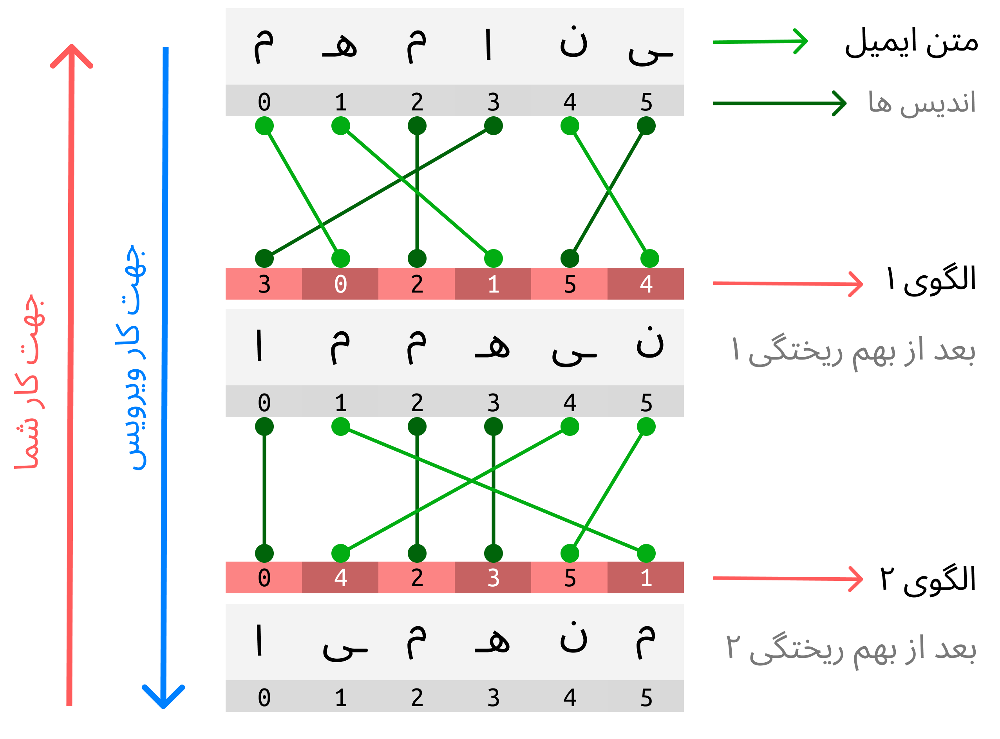

# مسابقه برنامه نویسی  یلدا کد 1401 

## نحوه شرکت :: how to attend
هر شرکت کننده باید در ربات تلگرام به آیدی 
[@yaldaaacodebot](https://t.me/yaldaaacodebot)
ثبت نام کند تا 
**ورودی مجزای**
خود را از ربات دریافت کند. 

در نهایت جواب خود را که
***یک بیت شعر***
است به همان ربات میفرستد، ربات اطلاعات شرکت کننده را در دیتایس خود ذخیره میکند و ادمین های مربوطه بعدا به آن شخص پیام میدهند. 
> در صورت دادن جواب صحیح لطفا از ربات خارخ نشوید

**مسابقه از ۲۹ آذر (سه شنبه) شروع شده و تا ۲ دی (جمعه) ادامه دارد.**

## مسئله :: problem
حمید و محمدحسن دو دوست صمیمی بودند که در دانشگاه شاهد تهران در دوره کارشناسی با هم آشنا شدند.
محمدحسن بعد از دوره کارشناسی، به دانشگاه
Oxford
آمریکا
apply
کرده و از ایران میرود. 
حمید اما در همان دانشگاه ادامه تحصیل میدهد.

با اینکه فقط چند ماه است که زمانه مسیر زندگی این دو دوست را از هم جدا کرده، ولی حمید یاد خاطره هایی که با محمدحسن داشته میفتد و دلش برای او تنگ میشود.
به مناسبت شب یلدا، حمید میخواهد تک بیت شعری از طریق ایمیل برای محمدحسن بفرستد و سر بحث را با او باز کند.

اما سازمان 
*CIA*
که از دوستی این دو بشر آگاه بوده است، برای کم رنگ کردن دوستی بین این دو، از هفته ها قبل ویروسی به لپتاپ محمدحسن فرستاده که حروف متن ایمیل از افراد خاصی را بهم میریزد.
با وجود این ویروس خبیث، محمدحسن عملا نمیتواند متن را بخواند.
البته این ویروس تاریخچه ای از این کارهای خود را در یک 
[log file](https://kaliboys.com/what-is-a-log-file/)
ذخیره میکند که میتواند امیدبخش باشد.

به محمدحسن کمک کنید با استفاده از
log file
تولیدی توسط ویروس، متن بهم ریخته را به حالت اولیه برگرداند و حمید نیز از انتظار برای جواب محمدحسن، دق مرگ نشود.

## مثال ۱ :: example 1
فرض کنید که متن ایمیل "ایمهنم" بوده و فایل
log 
ای که ویروس تولید کرده به این صورت باشد:
```
3 0 2 1 5 4
0 4 2 3 5 1
```
کار شما این است که الگوهای تبدیلی که توی فایل 
log هست رو روی متن ایمیل به صورت برعکس اعمال کنید تا به کلمه اول 
("مهمانی") 
که همان جواب مسئله است، برسید!




## مثال ۲ :: example 2
**ورودی ها:**

!table
- متن ایمیل
  1. "دبا یلش"
- فایل log تولیدی توسط ویروس
  1. ```
1 5 4 6 3 2 0
6 5 1 3 2 0 4
0 2 3 5 4 6 1
0 6 3 2 4 5 1
6 2 3 1 5 4 0```

**روند به این صورته:**

!table
- متن در هر مرحله
  1. "دبا یلش"
  2. "ش بالید"
  3. "شدابلی "
  4. "ش دالبی"
  5. "بدلای ش"
  6. "شب یلدا"
- الگو
  1. `-`
  2. `6 2 3 1 5 4 0`
  3. `0 6 3 2 4 5 1`
  4. `0 2 3 5 4 6 1`
  5. `6 5 1 3 2 0 4`
  6. `1 5 4 6 3 2 0`
- توضیحات
  1. متن ایمیل
  2. بعد از برگرداندن از آخرین بهم ریختگی (5) 
  3. بعد از برگرداندن از بهم ریختگی 4
  4. بعد از برگرداندن از بهم ریختگی 3
  5. بعد از برگرداندن از بهم ریختگی 2
  6. بعد از برگرداندن از بهم ریختگی 1

**خروجی:**
"شب یلدا"

## نکات :: notes
اگر از زبان های سطح پایین مثل
(مانند C یا ++C )
استفاده میکنید، حتما باید توجه داشته باشید که حروف فارسی در 2 تا
`char`
ذخیره میشوند 
(برای حل این مشکل میتوانید هر حرف را در
`string`
یا 
`wide_char`
ذخیره کنید
).

اما در زبان های سطح بالا 
(مثل Python یا JavaScript یا Java)
درصورتی که از نوع داده 
`string`
استفاده کنید، لازم نیست توجهی به این موضوع کنید.

> برای اطلاعات بیشتر در این خصوص، مقاله 
> [UTF-8](https://vrgl.ir/a6wO2)
> که توسط انجمن علمی نوشته شده را بخوانید.

اندازه فایل های 
log 
در حدود 80 تا 100 خط است.

## یادداشت ها :: footnotes
ایده گرفته شده از مسابقه برنامه نویسی 
[Advent Of Code](https://vrgl.ir/D9TSd).
